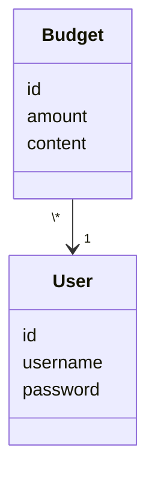

# Architecture explanation

## Structure

The application has 3 main layers. Top layer being UI. This is what the user sees and where the user can interact with the app. 2nd is the Service layer, which contains the information of what happens when the user interacts with the UI layer, for example when user adds a transaction. 3rd is the Repository layer. This layer saves information to SQLite.

## Operating system

Application consist out of 4 different views: register, login, main view, create a new transaction.

\#Explaining more later when known how it Works. 

## Application logic

The application has classes User and Budget. They describe users and their bugdets.

\#Explaining more later

