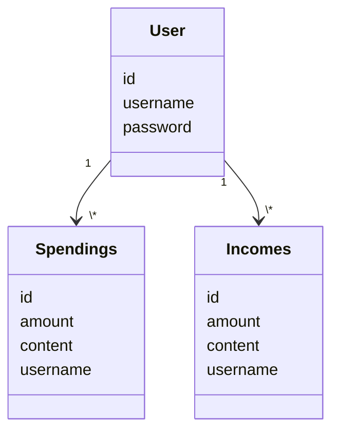

# Architecture explanation

## Structure

The application has 3 main layers. Top layer being UI. This is what the user sees and where the user can interact with the app. 2nd is the Service layer, which contains the information of what happens when the user interacts with the UI layer, for example when user adds a transaction. 3rd is the Repository layer. This layer saves information to SQLite.

Sequence diagram:
The main functualities of the application can be viewed in the sequence diagram below, and more detailed information can be read below.

[Sequence diagram](budget-app/dokumentaatio/SekvenssikaavioBudget-App.png)
In case the link doesn't work the file is in dokumentaatio as SekvenssikaavioBudget-App.png

The application contains 3 main layers, ui, services and repositories. You can view the detailed UML from the given link, but the layers communicate within eachother.

## User interface (ui):
Here is what the UI directory consists of:
Consists out of next views:

- Register view
- Log in view
- Logged in view
- Create a new spending view
- Create a new income view

All of the above have their on classes, and logged in view also has two other classes (income/spending lists) that are in their own files. UI class redirects the user from one view to another and deletes an older frame. It has been designed as separate as possible from the logics layer, and calls only Service layers methods.

## Applications Logics layer
Classes User, Income and Spending create the base for the applications logics. The classes describe users, and their logged information, such as incomes and spendings.

The IncomeService and SpendingService provide similar methods for the application, just from their own class. For example: 
- get_all_income(username)
- add_income(username, amount, content)
- sum_numbers(username)
- delete_income(id)

And the Service side contains the same. They get the needed information from repostirories layer. It either asks for the information from the database or adds the needed information to the database. The repository layer consists out of classes like UserReposirtory, IncomeRepository and SpendingRepository.

## Database
Repository layer downloads the information into SQLite-database. The information can be deleted or new information added into database. 