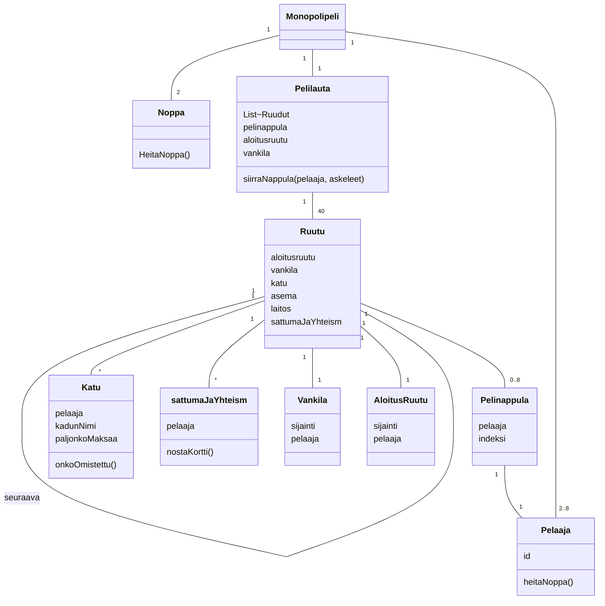

```mermaid
 classDiagram
    Monopolipeli "1" -- "2" Noppa
    class Noppa{
        HeitaNoppa()
    }
    Monopolipeli "1" -- "1" Pelilauta
    class Pelilauta{
        List~Ruudut
        pelinappula
        aloitusruutu
        vankila
        siirraNappula(pelaaja, askeleet)
    }
    Pelilauta "1" -- "40" Ruutu
    class Ruutu{
        aloitusruutu
        vankila
        katu
        asema
        laitos
        sattumaJaYhteism
    }
    Ruutu "1" -- "1" Ruutu : seuraava
    Ruutu "1" -- "0..8" Pelinappula
    class Pelinappula{
        pelaaja
        indeksi
    }
    Pelinappula "1" -- "1" Pelaaja
    class Pelaaja{
        id
        heitaNoppa()
    }
    Ruutu "1" -- "*" Katu
    class Katu{
        pelaaja
        kadunNimi
        paljonkoMaksaa
        onkoOmistettu()
    }
    Ruutu "1" -- "*" sattumaJaYhteism
    class sattumaJaYhteism{
        pelaaja
        nostaKortti()
    }
    Ruutu "1" -- "1" Vankila
    class Vankila{
        sijainti
        pelaaja
    }
    Ruutu "1" -- "1" AloitusRuutu
    class AloitusRuutu{
        sijainti
        pelaaja
    }
    Pelaaja "2..8" -- "1" Monopolipeli
```